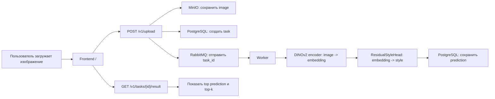

# Art Style Classifier

Сервис для классификации художественного стиля изображения. Пользователь загружает картинку, backend ставит задачу в очередь, worker считает предсказание реальной ML-моделью и сохраняет результат. Если пользователь исправляет стиль, feedback можно экспортировать и использовать для дообучения классификационной головы.

## Что Внутри

- `frontend` - React/Vite интерфейс для загрузки изображения, просмотра результата и отправки correction feedback.
- `api` - FastAPI backend: загрузка файлов, задачи, результаты, admin API.
- `worker` - обработчик inference-задач из RabbitMQ.
- `postgres` - задачи, результаты, feedback, состояние активной модели.
- `rabbitmq` - очередь inference-задач.
- `minio` - локальное S3-хранилище загруженных изображений.
- `mlflow` - registry для внешних версий модели, если понадобится.

## Как Работает Классификация



DINOv2 не дообучается. Он нужен как frozen feature extractor: превращает картинку в embedding. Классификационная голова (`head_*.pt`) уже по embedding предсказывает один из production style codes.

При первом реальном predict worker может скачать `facebook/dinov2-large` с HuggingFace. Это происходит не во время Docker build, а при первом использовании модели.

## Feedback И Retrain

```mermaid
flowchart LR
  A["Prediction неверный"] --> B["Пользователь выбирает correct_style_code"]
  B --> C["POST /v1/tasks/{task_id}/feedback"]
  C --> D["PostgreSQL: approved feedback"]
  D --> E["Admin: Export feedback CSV"]
  E --> F["approved_feedback.csv + images"]
  F --> G["Admin: Run retrain"]
  G --> H["retrain_from_feedback.py"]
  H --> I["Считать DINOv2 embeddings для feedback"]
  I --> J["Объединить base feature store + feedback"]
  J --> K["Переобучить только classification head"]
  K --> L["Сохранить новый model bundle"]
  L --> M["Если validation OK: обновить current_meta.json"]
```



Для retrain нужен большой base feature store:

```text
backend/src/artstyle_backend/ml_model/model_bundle/features_large_cls_mean_top18_contemporary_merged_v1.npz
```

Этот файл не хранится в Git, потому что весит больше лимита GitHub. Его нужно скачать вручную и положить в указанную папку.

Ссылка на `.npz`: [Yandex Disk](https://disk.yandex.ru/d/v-RHdGLNrRDzeQ)

## Быстрый Запуск

Требования:

- Docker
- Docker Compose
- свободные порты `5173`, `8000`, `5432`, `5672`, `9000`, `9001`, `5001`

Клонировать проект:

```bash
git clone https://github.com/UUyy-Geniy/art-style-classifier.git
cd art-style-classifier
```

Если нужен feedback retrain, скачайте `.npz` по ссылке выше и положите файл сюда:

```text
backend/src/artstyle_backend/ml_model/model_bundle/features_large_cls_mean_top18_contemporary_merged_v1.npz
```

Запустить весь стек:

```bash
docker compose up --build
```

Основные URL:

- Frontend: `http://localhost:5173`
- Admin page: `http://localhost:5173/admin`
- Backend Swagger: `http://localhost:8000/docs`
- RabbitMQ UI: `http://localhost:15672`
- MinIO Console: `http://localhost:9001`
- MLflow: `http://localhost:5001`

Admin token по умолчанию:

```text
change-me
```

## Проверка Inference

1. Открыть `http://localhost:5173`.
2. Загрузить `JPG`, `PNG` или `WEBP` до 10 MB.
3. Дождаться статуса `succeeded`.
4. Проверить top prediction и top-k.
5. Если стиль неверный, выбрать correct style и нажать `Save correction`.

Логи worker:

```bash
docker compose logs -f worker
```

Если DINOv2 ещё не был скачан, при первой классификации в логах будет загрузка модели с HuggingFace, затем:

```text
Энкодер загружен | device=cpu
Голова загружена: head_...
LabelEncoder загружен: label_encoder_...
```

## Проверка Feedback Retrain

1. Сделать несколько классификаций.
2. На каждой неверной классификации сохранить correction feedback.
3. Открыть `http://localhost:5173/admin`.
4. Ввести admin token: `change-me`.
5. Нажать `Export feedback CSV`.
6. Убедиться, что поле `Feedback CSV path` заполнилось.
7. Нажать `Run retrain`.
8. Смотреть статус job внизу страницы или через кнопку `Retrain jobs`.

Production-настройка ожидает минимум `20` валидных feedback-изображений. Для smoke-теста можно временно поставить `Min feedback = 1`, `Epochs = 1`, `Min val accuracy = 0`, но такую модель не стоит считать качественной.

Чтобы новая модель стала активной:

1. Включить `Activate if validation passes`.
2. Дождаться успешного retrain.
3. Нажать `Reload workers` в admin page или перезапустить `worker`.

## Полезные Команды

Остановить стек:

```bash
docker compose down
```

Остановить и удалить volumes:

```bash
docker compose down -v
```

Пересобрать backend:

```bash
docker compose build api worker
```

Посмотреть API:

```bash
open http://localhost:8000/docs
```

## Важные Детали

- Production style code для объединённых классов: `Contemporary_Art`.
- В production не должно быть отдельных style codes `Minimalism`, `Pop_Art`, `Color_Field_Painting`.
- Backend inference читает активную модель через `model_bundle/current_meta.json`.
- Большой `.npz` нужен для retrain, но не должен попадать в Git.
- `.gitignore` и `.dockerignore` уже игнорируют `backend/src/artstyle_backend/ml_model/model_bundle/*.npz`.
